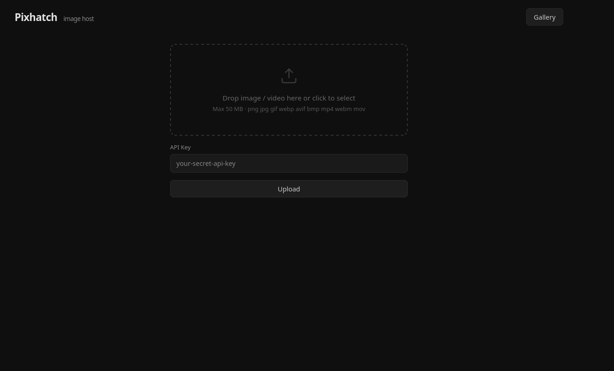

# Pixhatch

A self-hosted image and video hosting API. Upload files via a web UI, `curl`, or any HTTP client and get back a direct URL. Designed to run behind a reverse proxy (Nginx Proxy Manager) on a VPS.

> [!NOTE]
> AI helps me build this stuff. 🤖✨ I check over everything and try to squash bugs as fast as possible. Not a master, just building and learning!

## Features

- Drag-and-drop web UI with Gallery, dark theme 
- REST API endpoint — returns a plain URL, easy to script
- API key authentication (timing-safe comparison)
- Per-IP rate limiting (in-memory, no Redis required)
- Extension whitelist: images (`png`, `jpg`, `jpeg`, `gif`, `webp`, `avif`, `bmp`) and video (`mp4`, `webm`, `mov`, `m4v`)
- Security headers on all served files (`CSP`, `X-Content-Type-Options`, `X-Frame-Options`)
- Configurable via environment variables
- Single Docker image, ~50 MB

---
<p align="center">
  
</p>

## Project structure

```
pixhatch/
├── server.js               # Express API server
├── public/
│   └── index.html          # Web UI
├── Dockerfile
├── docker-compose.yml      # Pixhatch service (joins external proxy network)
├── docker-compose.npm.yml  # Nginx Proxy Manager (creates the proxy network)
└── package.json
```

---

## Quick start (local)

```bash
npm install
API_KEY=secret BASE_URL=http://localhost:3000 npm start
```

Open `http://localhost:3000` to use the web UI, or upload via curl:

```bash
curl -X POST http://localhost:3000/upload \
  -H "X-API-Key: secret" \
  -F "file=@photo.png"
# → http://localhost:3000/uploads/a1b2c3d4.png
```

---

## Production setup (Docker + Nginx Proxy Manager)

### 1. Build the image on your VPS

```bash
cd /opt/pixhatch
docker build -t pixhatch:latest .
```

### 2. Deploy Nginx Proxy Manager first

NPM creates the shared `proxy` Docker network that Pixhatch joins.

1. Open Portainer → **Stacks** → **Add stack**
2. Name it `npm`, paste `docker-compose.npm.yml`, click **Deploy**
3. NPM admin UI → `http://your-vps-ip:81`
   - Default login: `admin@example.com` / `changeme` — **change immediately**

### 3. Deploy Pixhatch

1. Open Portainer → **Stacks** → **Add stack**
2. Name it `pixhatch`, paste `docker-compose.yml`
3. Edit the environment variables before deploying:

   | Variable | What to set |
   |---|---|
   | `API_KEY` | A strong random secret — `openssl rand -hex 32` |
   | `BASE_URL` | Your public domain, e.g. `https://img.yourdomain.com` |

4. Click **Deploy**

> Port 3000 is **not** exposed to the host — Pixhatch is only reachable internally via the `proxy` network. Uploads are stored in a named volume (`pixhatch_uploads`) and persist across restarts.

### 4. Configure reverse proxy in NPM

1. NPM → **Proxy Hosts** → **Add Proxy Host**

   | Field | Value |
   |---|---|
   | Domain Names | `img.yourdomain.com` |
   | Scheme | `http` |
   | Forward Hostname / IP | `pixhatch` |
   | Forward Port | `3000` |
   | Block Common Exploits | ✅ |

2. **SSL** tab → request a Let's Encrypt certificate → enable **Force SSL** → Save

NPM resolves `pixhatch` by container name because both stacks share the `proxy` network.

---

## Environment variables

| Variable | Default | Description |
|---|---|---|
| `API_KEY` | *(none — auth disabled!)* | Secret key required on upload requests |
| `BASE_URL` | `http://localhost:3000` | Public URL prefix used in returned links |
| `PORT` | `3000` | Port the server listens on |
| `MAX_SIZE_MB` | `50` | Maximum upload size in megabytes |
| `UPLOAD_DIR` | `./uploads` | Directory where files are stored |
| `RATE_LIMIT_PER_MIN` | `30` | Max upload requests per IP per minute |

**Warning:** if `API_KEY` is not set, the upload endpoint is open to anyone who can reach it.

---

## API reference

### `POST /upload`

Upload a single file.

**Headers**

| Header | Required | Description |
|---|---|---|
| `X-API-Key` | If `API_KEY` is set | Your secret API key |

**Body** — `multipart/form-data`

| Field | Description |
|---|---|
| `file` | The file to upload |

**Response**

| Status | Body | Meaning |
|---|---|---|
| `200` | `https://img.yourdomain.com/uploads/a1b2c3d4.png` | Plain-text direct URL |
| `400` | Error message | No file provided, unsupported type |
| `401` | `Unauthorized` | Missing or wrong API key |
| `413` | `File too large. Max: 50MB` | File exceeds `MAX_SIZE_MB` |
| `429` | `Too Many Requests` | Rate limit exceeded |

**Example**

```bash
curl -X POST https://img.yourdomain.com/upload \
  -H "X-API-Key: your_api_key_here" \
  -F "file=@screenshot.png"
```

Response:
```
https://img.yourdomain.com/uploads/a1b2c3d4.png
```

### `GET /uploads/:filename`

Serve an uploaded file. No authentication required — files are public once uploaded.

### `GET /`

Serves the web UI (`public/index.html`).

---

## Upload script

Drop-in shell script:

```bash
#!/usr/bin/env bash
# usage: ./upload.sh image.png

API_KEY="your_api_key_here"
BASE_URL="https://img.yourdomain.com"

curl -sS -X POST "${BASE_URL}/upload" \
  -H "X-API-Key: ${API_KEY}" \
  -F "file=@${1}"
```

```bash
chmod +x upload.sh
./upload.sh photo.png
# → https://img.yourdomain.com/uploads/a1b2c3d4.png
```

---

## Security notes

- API key is compared with `crypto.timingSafeEqual` to prevent timing attacks.
- Uploaded files are served with a strict `Content-Security-Policy` that disables script execution and sandboxes the frame — defense-in-depth against malicious file content.
- File extension whitelist is enforced before the file is written to disk; unsolicited extensions are rejected with `400`.
- The server disables the `X-Powered-By` header.

---

## License

MIT
